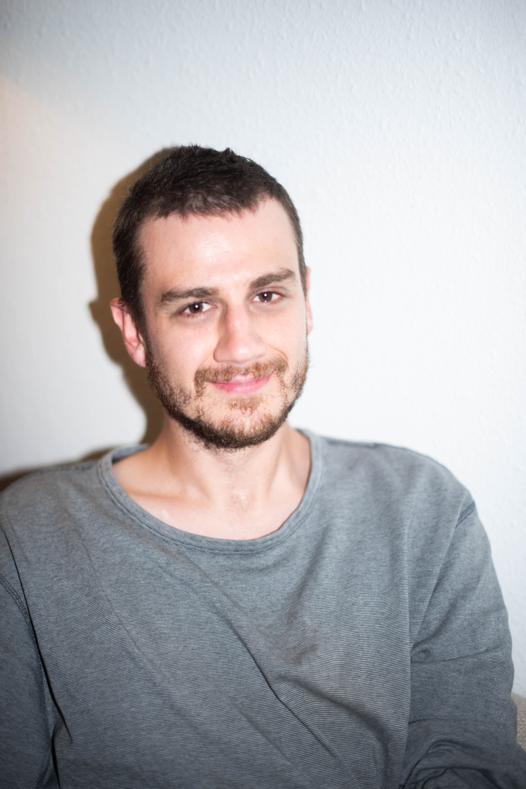

<nav style="font-size:1.1em; margin-bottom:2em;">
  <a href="/csoblog">Forside</a> ·
  <a href="/csoblog/hvorfor">Valget af fag</a> ·
  <a href="/csoblog/postsui/">UI/UX</a> ·
  <a href="/csoblog/postssu/">Spiludvikling</a> ·
  <a href="/csoblog/posts/">Generelt</a> ·
  <a href="/csoblog/about">Om mig</a>
</nav>

  

# Velkommen til min læringsrejse

Hej, og tak fordi du kigger forbi!

Denne blog er mit **personlige rum**, hvor jeg deler tanker, erfaringer og indsigter fra min egen læringsproces i mine to valgfag: **UI/UX** og **Spiludvikling**.

[Hvorfor netop disse to valgfag?](https://chstol.github.io/csoblog/hvorfor)

**Læring er ikke en destination – men en rejse.**

Her skriver jeg åbent om, **hvad jeg lærer**, hvilke **udfordringer jeg møder**, og hvordan jeg hele tiden prøver at udvikle mig.

---

## Hvad kan du finde her?
- ✍️ **Refleksioner** over min læring
- 📚 **Opsummeringer** af bøger, artikler og ressourcer jeg bruger
- 💡 **Ideer, metoder og værktøjer** der hjælper mig
- 🌱 **Små skridt** mod personlig og faglig udvikling

---

## Hvorfor denne blog?
Jeg har startet denne blog for at:

1. **Dokumentere min rejse** – så jeg kan se tilbage og lære af mine egne erfaringer.
2. **Skabe samtale** – læring bliver stærkere, når vi deler og reflekterer sammen.
3. **Dele med andre** – måske kan noget af det, jeg skriver, inspirere dig i din egen læring.

---

## Arkiv 🗂️

### 🎨 UI/UX
- *(kommende indlæg …)*

### 🎮 Spiludvikling
- *(kommende indlæg …)*

### 📦 Generelt
- [Kolb's læringscyklus](https://chstol.github.io/csoblog/posts/PostOmKolb)
- *(flere indlæg kommer løbende …)*

---

<footer style="font-size:0.9em; color:black; margin-top: 2em;">
  © 2025 CSO Blog – Alle rettigheder forbeholdes · <a href="/csoblog/about">Om mig</a>
</footer>
